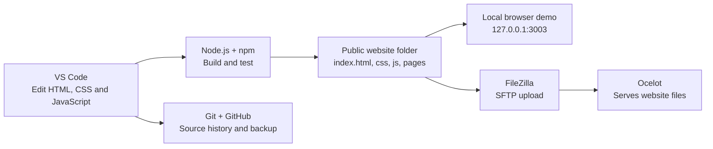
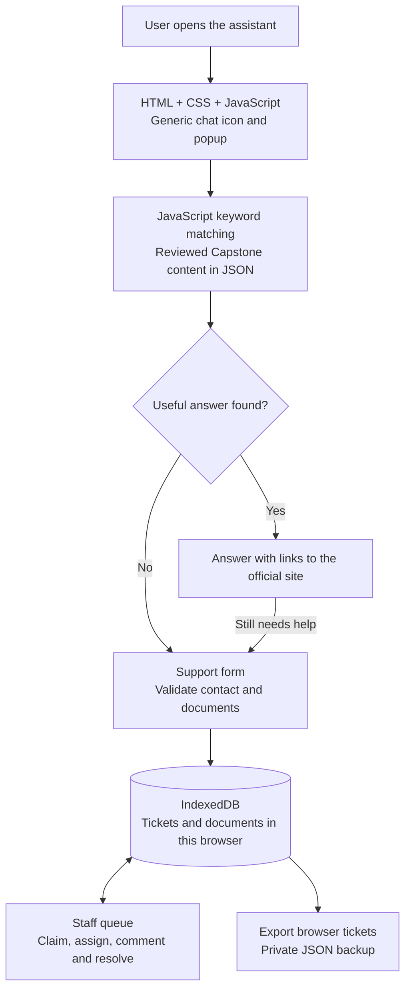
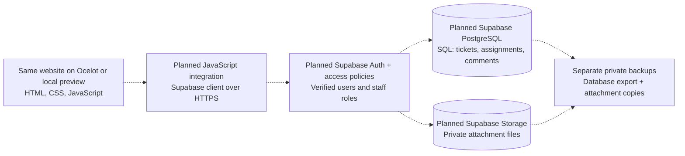

# Capstone - AI - project workflow and technology sheet

Branding updated September 24, 2026. [Printable workflow sheet](output/pdf/Capstone_AI_Workflow.pdf).

**Status:** The browser-only demo exists. The owner has now confirmed creation of a Supabase project; **the application connection is still pending**. The proposed shared backend below is not yet in use. This document does not deploy code, migrate tickets, or enable professor email. The current prototype is separate from the official FIU Capstone site and uses fictional test data only.

### Supabase project recorded

Implementation update: the JavaScript Supabase adapter, private Storage flow, email/password staff login, and SQL migrations now exist locally. The dashed connections below still mean **not activated or verified in the hosted project**. Run the one-time setup and live acceptance in [the setup guide](SUPABASE_SETUP.md) before treating the diagram as an operational shared queue. The printable sheet remains an overview of the current-vs-proposed deployment boundary.

- Project URL: `https://mkpkjmqjbfhkazxgpggg.supabase.co`
- Project reference: `mkpkjmqjbfhkazxgpggg`
- Creation was reported by the owner on September 18, 2026. Dashboard configuration, database contents, authentication, and access policies have not been inspected or verified.
- The owner supplied a **publishable key**, now saved only in the ignored local readiness-check configuration. Supabase Auth settings accepted it (HTTP 200). The ticket table is not available in the Data API (`PGRST205`); app integration and ticket writes remain unverified. See [Supabase setup and repeatable checks](SUPABASE_SETUP.md). Never paste a secret key, `service_role` key, database password, or access token into chat or browser code. [Official API key guidance](https://supabase.com/docs/guides/api/api-keys).
- Creating the project does not create this application's ticket tables, private attachment bucket, or access rules. The existing email-only demo is not sufficient authorization for shared records.

## 1. What builds and delivers the site

GitHub stores source-code history, not the live ticket database. Only the generated inner `Capstone - AI` folder is uploaded. `DEVELOPMENT`, private records, documents, tests, and archives stay outside the public website. Ocelot upload/readiness still requires the checks in [the upload guide](OCELOT_UPLOAD_GUIDE.md); the diagram shows the delivery path, not a claim that the newest release is deployed.

## 2. Current browser-demo workflow

The search is deterministic, site-grounded retrieval, not a paid language-model call. It uses a reviewed local content snapshot, not a live crawler or the student's FIU account. Unsupported questions prompt a support request. The queue records work notes and additional comments; requester preview excludes internal notes, but browser-only storage does not provide secure access control against the device user.

Current staff entry is an approved-email demo selector, not verified identity. Each browser/profile/site address has its own queue. Clearing site data can erase it. No professor email is sent. Exports include ticket/document data; automated restore/import is not implemented.

## 3. Planned workflow with Supabase

All dashed connections are **proposed, not implemented**. Once integrated and tested, users on different devices could work from the same online queue. Supabase would store application data; Ocelot could continue serving the website. Choosing the free plan does not itself connect the app or make data access safe.

The proposed security boundary needs verified identity, staff roles, Row Level Security (RLS) for database records, and private-file policies. Work notes should use separate staff-only records or an equivalently enforced design; hiding a field in HTML is not authorization. Do not put a privileged Supabase service-role/secret key in browser code. The existing email-only selector must not become shared-data authorization. Requester sign-in, guest submission protection, and institutional SSO remain design decisions, not completed integrations. [Database security](https://supabase.com/docs/guides/database/postgres/row-level-security).

Shared storage is not the same thing as a backup. Supabase recommends regular off-site exports for free projects. Database backups do not include the actual files stored through Storage, so attachment copies need their own backup/recovery procedure. [Backup documentation](https://supabase.com/docs/guides/platform/backups).

## 4. Languages, formats, and tools

| Component | Language or technology | Role | Status |
| --- | --- | --- | --- |
| Website structure | HTML | Pages, forms, dialogs, buttons | Current |
| Website appearance | CSS | FIU-inspired layout, colors, responsive styling | Current |
| Chat and staff queue | JavaScript | Keyword search, validation, forms, ticket views and updates | Current |
| Reviewed knowledge | JSON | Site-content data format; not a programming language | Current |
| Browser ticket store | IndexedDB, accessed through JavaScript | Local browser tickets and documents; not shared | Current demo |
| Local tooling | Node.js + npm | JavaScript runtime and build/test commands; not separate languages | Current |
| Code editor/version history | VS Code, Git, GitHub | Editing, source control, source backup | Current tools |
| Upload and website hosting | FileZilla/SFTP, Ocelot | Transfer and serve public website files | Existing delivery path |
| Server-backed local alternative | JavaScript on Node.js | API and private local file storage | Implemented alternative |
| Ocelot server alternative | PHP | Shared private server-file storage | Implemented; host write access blocked |
| Supabase database | PostgreSQL, queried/configured with SQL | Shared tickets, relations, queries, and access policies | Project created by owner; app schema/integration pending |
| Supabase website connection | JavaScript (`supabase-js`) | Read/write data, authentication, and file operations over APIs | Planned |
| Optional Supabase server logic | TypeScript Edge Functions | Custom protected server operations/notifications if selected | Optional future work |

**What language does Supabase use for our project?** Primarily **SQL** for its **PostgreSQL** database, plus **JavaScript** to connect the website. Supabase is a platform, not one programming language. Optional Edge Functions use TypeScript; they are not required just to display or save basic ticket data and are not currently installed in this project. [PostgreSQL database](https://supabase.com/docs/guides/database/overview), [JavaScript client](https://supabase.com/docs/reference/javascript/introduction), [Edge Functions](https://supabase.com/docs/guides/functions).

The Node and PHP implementations are alternatives, not layers that must both run behind Supabase. No React, paid AI API, or live portal login is required for the current browser demo.

## 5. Not connected yet

- Application integration with the owner-created Supabase project; database schema, private document bucket, authentication, and access policies are pending/unverified.
- Shared cross-device ticket persistence or migration of existing browser/Node/PHP records.
- Professor email notifications and real requester-facing communication.
- Official Capstone portal source integration, FIU identity/roles, and production approval.

See the [deployment and integration plan](DEPLOYMENT_AND_INTEGRATION_PLAN.md) for future release requirements. No application behavior was changed by creating this sheet.

## Sources and maintenance

Project facts were checked against `package.json`, the preview/build scripts, the shared browser API, keyword-search implementation, and the existing deployment guides. Supabase capabilities were checked against its official documentation on September 18, 2026:

- [Database and SQL](https://supabase.com/docs/guides/database/overview)
- [JavaScript client](https://supabase.com/docs/reference/javascript/introduction)
- [Storage](https://supabase.com/docs/guides/storage)
- [Row Level Security](https://supabase.com/docs/guides/database/postgres/row-level-security)
- [Backups](https://supabase.com/docs/guides/platform/backups)
- [TypeScript Edge Functions](https://supabase.com/docs/guides/functions)

The printable PDF is built by `scripts/build-workflow-sheet.py` using document-only Python tools (ReportLab). Python is not an application runtime or a requirement for teammates to run the demo. Update the diagram and status labels when the actual integration changes; this document does not update automatically.
